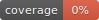

# {{ cookiecutter.project_name.title().replace('_', ' ').replace('-', ' ') }}

---

<div align="center">

[](https://github.com/{{ cookiecutter.github_name }}/{{ cookiecutter.project_name }}/actions?query=workflow%3Abuild)
[](https://pypi.org/project/{{ cookiecutter.project_name }}/)
[](https://github.com/{{ cookiecutter.github_name }}/{{ cookiecutter.project_name }}/pulls?utf8=%E2%9C%93&q=is%3Apr%20author%3Aapp%2Fdependabot)

[](https://github.com/psf/black)
[](https://github.com/PyCQA/bandit)
[](https://github.com/{{ cookiecutter.github_name }}/{{ cookiecutter.project_name }}/blob/master/.pre-commit-config.yaml)
[](https://github.com/{{ cookiecutter.github_name }}/{{ cookiecutter.project_name }}/releases)
[](https://github.com/{{ cookiecutter.github_name }}/{{ cookiecutter.project_name }}/blob/master/LICENSE)


{{ cookiecutter.project_description }}

</div>

---

## Features

## Installation

```bash
pip install {{ cookiecutter.project_name }}
```

Then you can run

```bash
{{ cookiecutter.project_name }} --help
```



## Usage

## 📈 Releases

You can see the list of available releases on the [GitHub Releases](https://github.com/{{ cookiecutter.github_name }}/{{ cookiecutter.project_name }}/releases) page.

## 🛡 License

[](https://github.com/{{ cookiecutter.github_name }}/{{ cookiecutter.project_name }}/blob/master/LICENSE)

This project is licensed under the terms of the `{{ cookiecutter.license }}` license. See [LICENSE](https://github.com/{{ cookiecutter.github_name }}/{{ cookiecutter.project_name }}/blob/master/LICENSE) for more details.
